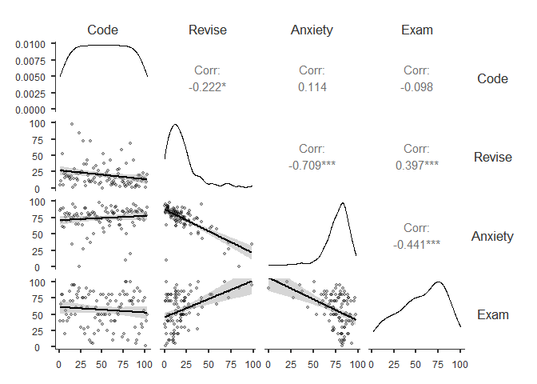
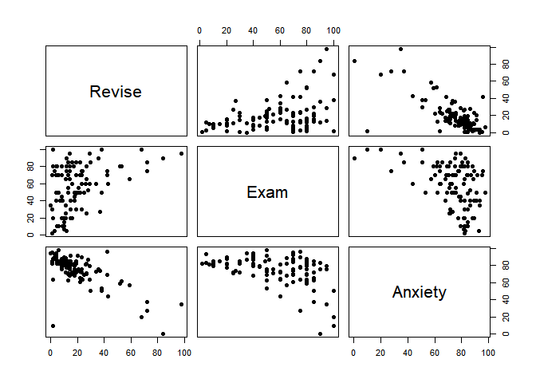
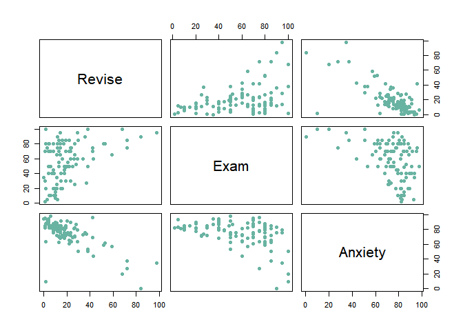
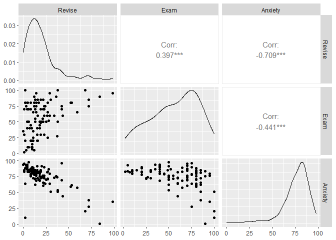
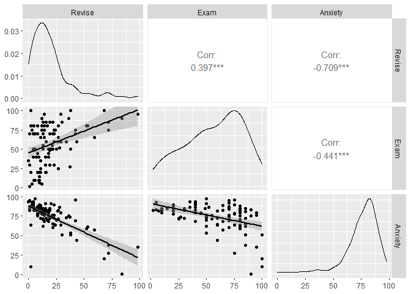

``` r
dataset = rio::import("Exam Anxiety.sav")
data = dataset
```

# Correlation

## Create a scatterplot matrix

``` r
jmv::corrMatrix(
  data = dataset,
  vars = vars(Code, Revise, Anxiety, Exam),
  flag = TRUE,
  n = TRUE,
  ci = TRUE,
  plots = TRUE,
  plotDens = TRUE,
  plotStats = TRUE)
```

    ## 
    ##  CORRELATION MATRIX
    ## 
    ##  Correlation Matrix                                                                 
    ##  ---------------------------------------------------------------------------------- 
    ##                               Code          Revise        Anxiety       Exam        
    ##  ---------------------------------------------------------------------------------- 
    ##    Code       Pearson's r              —                                            
    ##               p-value                  —                                            
    ##               95% CI Upper             —                                            
    ##               95% CI Lower             —                                            
    ##               N                        —                                            
    ##                                                                                     
    ##    Revise     Pearson's r     -0.2218286             —                              
    ##               p-value          0.0243239             —                              
    ##               95% CI Upper    -0.0295735             —                              
    ##               95% CI Lower    -0.3982564             —                              
    ##               N                      103             —                              
    ##                                                                                     
    ##    Anxiety    Pearson's r      0.1135652    -0.7092493             —                
    ##               p-value          0.2533730    < .0000001             —                
    ##               95% CI Upper     0.3004859    -0.5977733             —                
    ##               95% CI Lower    -0.0817562    -0.7938168             —                
    ##               N                      103           103             —                
    ##                                                                                     
    ##    Exam       Pearson's r     -0.0977938     0.3967207    -0.4409934            —   
    ##               p-value          0.3257336     0.0000334     0.0000031            —   
    ##               95% CI Upper     0.0975776     0.5481602    -0.2705591            —   
    ##               95% CI Lower    -0.2859075     0.2200938    -0.5846244            —   
    ##               N                      103           103           103            —   
    ##  ---------------------------------------------------------------------------------- 
    ##    Note. * p < .05, ** p < .01, *** p < .001



``` r
# The pairs and plots functions are part of baseR

# pairs using column numbers
pairs(data[,2:4], pch = 19)

# pairs using formula format
pairs(~Revise + Exam + Anxiety, data=data, pch = 19)
```



``` r
# Plot
plot(data[ , 2:4] , pch=20 , cex=1.5 , col="#69b3a2")
```



``` r
# the ggpairs function is part of GGally package which expands ggplot2 package

library(ggplot2)
library(GGally)

# ggpairs using column numbers
GGally::ggpairs(data,columns=2:4)
```



``` r
# ggpairs using column names
GGally::ggpairs(data,columns=c('Revise','Exam','Anxiety'),lower = list(continuous = "smooth"))
```


